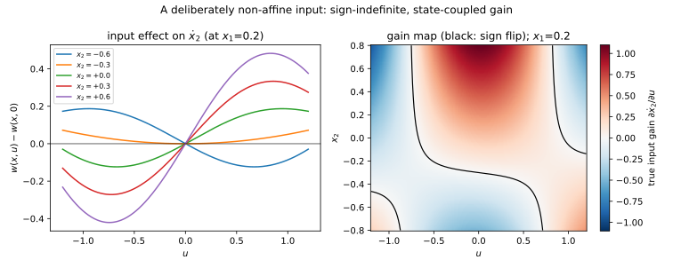
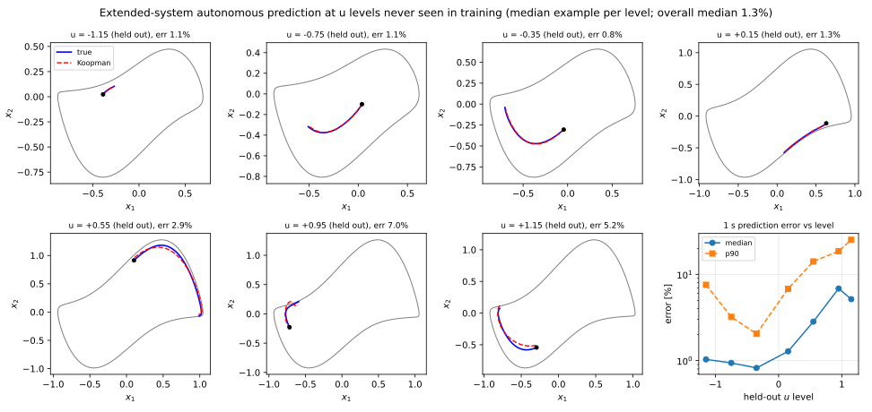
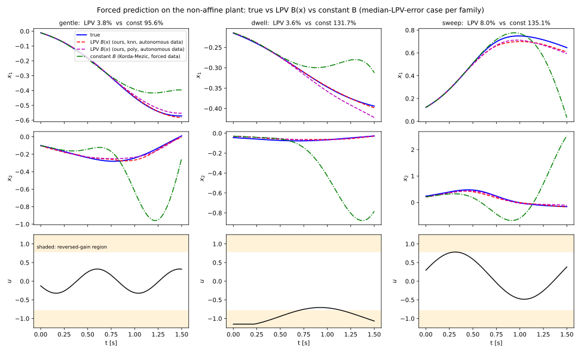
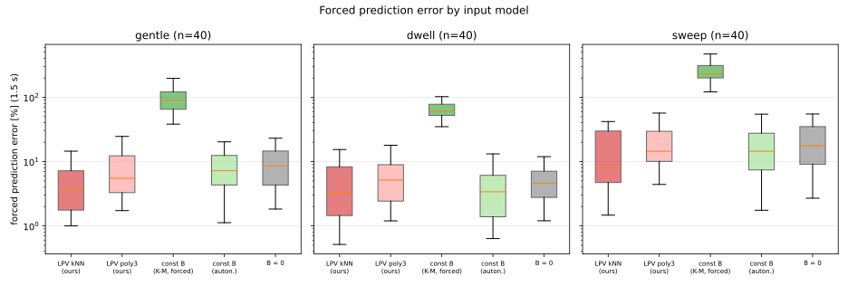
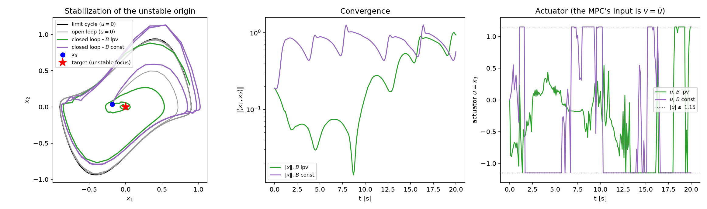
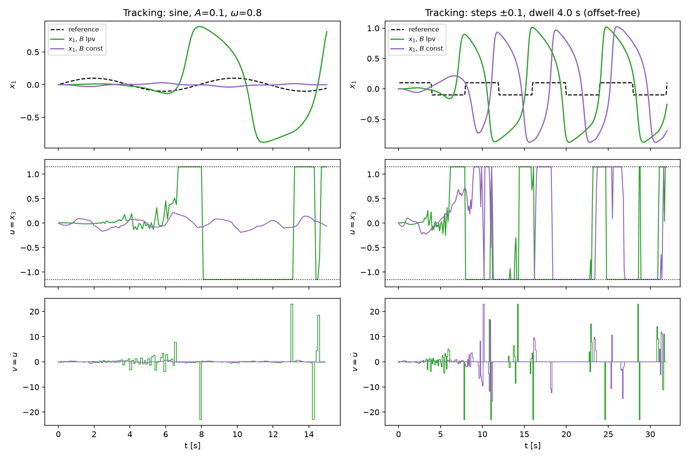
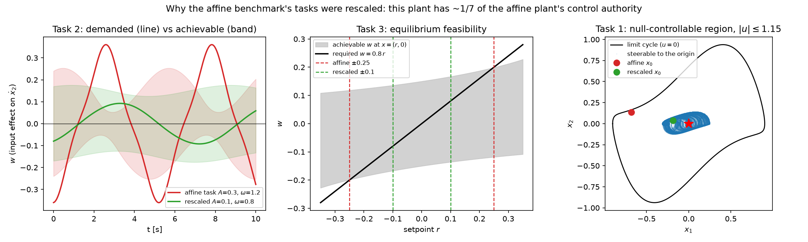

# Figure reference — every plot in `reports/figures/`, in full detail

This document exists purely to make each figure self-explanatory: what
exactly it plots, where every pixel/line/marker comes from in the code, what
data and model produced it, and how to read it. The narrative interpretation
of the *results* lives in the three validation reports
([`validation_vdp.md`](validation_vdp.md), [`validation_vdp_control.md`](validation_vdp_control.md),
[`validation_nonaffine.md`](validation_nonaffine.md)); this file is the
companion that documents the figures themselves as artifacts — how they were
built, so anyone can reproduce, audit, or modify them without reverse
engineering the plotting code.

All 14 figures are produced by four example scripts, each writing directly
into `reports/figures/`:

| figures | script | what it fits/evaluates | runtime |
|---|---|---|---|
| fig1 – fig5 | `examples/run_vdp_benchmark.py` | autonomous (uncontrolled) Koopman model of the Van der Pol oscillator | ~3 min |
| fig6 – fig8 | `examples/run_vdp_control_benchmark.py` | the LPV input matrix B(x) and forced prediction | ~3 min |
| fig9 – fig10 | `examples/run_vdp_mpc.py` | closed-loop Koopman-LPV MPC on the affine plant | ~12 min (whole script) |
| fig11 – fig14 | `examples/run_nonaffine_benchmark.py` | the non-affine input, its exact extension, LPV vs constant B | ~15 min (~7 min `--quick`) |
| fig15 – fig17 | `examples/run_vdp_mpc.py` | closed-loop MPC on the *non-affine* plant: LPV B(x) vs constant B, plus the actuation limits that set the tasks | (same script as fig9–fig10) |

Every script is deterministic given its fixed `np.random.default_rng(seed)`
calls (seeds are called out per figure below), matplotlib backend `Agg`,
`dpi=150`, and `fig.tight_layout()` before saving — re-running a script
reproduces its figures bit-for-bit (modulo floating-point nondeterminism in
BLAS across machines).

Two recurring building blocks, referenced by name throughout:

* **The error metric** (Korda & Mezić 2020, eq. 55), implemented in
  `metrics.relative_rmse_percent`:

  ```
  error[%] = 100 * ||x_pred - x_true||_F / ||x_true||_F
  ```

  computed over an entire predicted trajectory (all time samples, all state
  components) against the true trajectory from the same initial condition.
  This is what every colorbar/axis labeled "error [%]" or "prediction
  error" means unless stated otherwise.

* **The scaled Van der Pol plant** (`systems.vdp_scaled`), the system
  underlying figs 1–10:

  ```
  x1' = 2 x2
  x2' = -0.8 x1 + 2 x2 - 10 x1^2 x2        (+ u in the controlled case, x2' += u)
  ```

  unstable focus at the origin (linearized eigenvalues `1 ± i*sqrt(0.6)`),
  attracting limit cycle of amplitude ≈0.9 in both states, period ≈5.674 s
  (`ω0 = 1.1074` rad/s). The **limit cycle** drawn as a black curve in most
  figures is computed once by `vdp_benchmark.limit_cycle`: simulate 60 s
  from `(0.3, 0)`, keep the last 20 s (by then the trajectory has converged
  onto the cycle to machine precision), and cut out exactly one period by
  finding two consecutive upward zero-crossings of `atan2(x2, x1)`.

---

## Part 1 — Autonomous prediction (`run_vdp_benchmark.py`, figs 1–5)

### Models and data behind all five figures

The script fits many models across a sweep, but the figures only ever draw
from a handful of them:

* **`data5`** / **`data7`**: `vdp_benchmark.make_training_data(n_traj=100,
  horizon=…)` — 100 trajectories from initial conditions equally spaced on
  the circle of radius 0.05 around the origin (`circle_initial_conditions`),
  integrated with `solve_ivp` (RK45, `rtol=1e-10`) at `Ts = 0.01` s, for 5 s
  (`data5`, "paper configuration") or 7 s (`data7`, "extended
  configuration").
* **Test set**: 500 initial conditions (150 with `--quick`) sampled
  *uniformly over the interior of the limit-cycle polygon*
  (`vdp_benchmark.sample_interior`, rejection sampling inside the closed
  limit-cycle polyline), `rng = np.random.default_rng(7)`. Ground truth
  `x_true` is these 500 ICs integrated forward 1 s at `Ts=0.01`
  (101 samples, `t_pred = np.arange(101)*0.01`). `d_lc[j]` is the Euclidean
  distance from test IC `j` to the nearest point on the limit-cycle polyline
  (`scipy.spatial.cKDTree(lc).query(x0s)`) — the "how close to the cycle is
  this test point" scalar used for coloring and slicing in several figures.
* **`models["paper_N20_optimized"]`**: fit on `data5` with
  `FitConfig(n_eig=20, optimize=True)` — the closest match to the paper's
  own N = 20 configuration.
* **`best_model` / `models[best_key]`**, `best_key = "best_N40_optimized"`:
  fit on `data7` with `FitConfig(n_eig=40, optimize=True,
  alpha_bounds=(-20.0, 1.0))` — the script's best model, 0.83 % mean error
  over the full limit-cycle interior. This is the model that gets *shown*
  in figs 1 and 4, and is one of the two compared in figs 2 and 5.

Model fitting (`fit_koopman_model`) is the variable-projection eigenvalue
optimization described in the README's "method in five lines": start from
the DMD-derived eigenvalue lattice, refine with L-BFGS-B under the exact
analytic gradient of the projected boundary-fit cost, then re-solve the
per-trajectory boundary least squares at the optimized eigenvalues to get
tabulated eigenfunction values on the training cloud.

---

### `fig1_phase_portrait.png`


**Produced by**: lines 144–159, the first figure block.

**What it shows**: one phase-plane view (`x1` vs `x2`, equal aspect)
overlaying four independent layers:

1. **Training cloud** (light gray dots, `ms=1`, `color="0.75"`) —
   every 23rd point of `data7.flat_points()`, i.e. all sample points across
   all 100 trajectories of the 7 s extended-configuration training set,
   subsampled 1-in-23 purely to keep the scatter file size and render time
   reasonable (dense inward spirals from the r = 0.05 circle toward the
   limit cycle are visible as the fine gray texture).
2. **Limit cycle** (solid black, `lw=2`) — the one-period polyline described
   above.
3. **IC circle** (solid blue, `lw=1.5`, radius 0.05 around the origin) — the
   training circle every one of the 100 training trajectories starts on.
4. **500 test initial conditions** (`ax.scatter`, viridis colormap,
   `s=14`), each colored by `log10` of its 1-second prediction error under
   the **`best_N40_optimized` model** — the field labeled "`best_key`" in
   the plot title. The colorbar is in log₁₀(error %), so 0 = 1 % error,
   1 = 10 % error, etc.

**How to read it**: this is the single most direct visualization of model
quality across the whole operating region. With the N = 40 / 7 s model
almost every dot is dark blue/purple (log₁₀ error around −0.3 to 0, i.e.
0.5–1 %); there is no cluster of bright (high-error) points anywhere,
including right next to the limit cycle — which is the headline result of
§3 of `validation_vdp.md` (0.83 % mean including the near-LC band). The one
visibly brighter (yellow, ~log₁₀ ≈ 1.4, i.e. ~25 %) dot near the top-right
of the cycle is the model's single worst case among the 500 test points.

**Why initial conditions stay on a circle**: because, based on the paper, trajectory should start from a non recurrent surface/set (start there and never return to it), and the circle is the simplest star-shaped curve (the reason star-shapedness suffices here specifically is a Poincaré–Bendixson argument: in the annulus between the unstable focus and the attracting limit cycle there's no other invariant set, so the radius r(t) is monotonic along every orbit).

---

### `fig2_eigenvalues.png`


**Produced by**: lines 161–184.

**What it shows**: two side-by-side scatter panels (`sharey=True`) of the
continuous-time eigenvalues in the complex plane (`Re λ` on x, `Im λ` on
y), comparing what the linearization *predicts* against what the optimizer
*actually learned*, for two different fitted models:

* **Left panel** — `paper_N20_optimized` (5 s data, N = 20, the paper's own
  configuration).
* **Right panel** — `best_key` = `best_N40_optimized` (7 s data, N = 40).

Each panel draws:

* **Horizontal gray reference lines** at `k · ω0` for `k = -12 … 12`
  (`ω0 = 1.1074` rad/s, the limit cycle's fundamental angular frequency,
  set as a module constant `LC_OMEGA`) — these mark where a *true* Floquet
  spectrum on the limit cycle itself would sit (purely imaginary
  harmonics `i k ω0`).
* **Blue open squares**: the "linearization lattice" —
  `spectrum.lattice(base=[1+0.7746i, 1-0.7746i], max_degree=3)`, i.e. every
  non-negative-integer combination `n λ0 + m λ̄0` (n+m ≤ 3) of the origin's
  linearized eigenvalues `λ0 = 1 + i√0.6 ≈ 1 + 0.7746i` (the unstable
  focus's Jacobian eigenvalues). This is the theoretical spectrum an
  interior Koopman eigenfunction expansion is expected to populate near the
  fixed point, independent of any fitting.
* **Red ×**: `model.eigenvalues()` — the model's *actual* fitted
  continuous-time eigenvalues (both conjugate partners of every pair are
  plotted, since `Spectrum.to_complex()` returns `a+ib` and `a-ib`
  separately).
* A vertical gray line at `Re λ = 0` in each panel.

**How to read it**: in the left panel (N = 20), the learned (red) markers
sit close to the blue lattice squares — the optimizer, given only 20
degrees of freedom, essentially recovers the interior linearization
spectrum with small perturbations. In the right panel (N = 40), the
optimizer has room to do something qualitatively different: many learned
eigenvalues now sit *near the horizontal `k ω0` lines* with small-to-moderate
`Re λ` (roughly 0.2–1.0) rather than clustering only around the lattice
squares. This is the visual evidence, cited in `validation_vdp.md` §3, that
the extended (N = 40, 7 s) model discovers the two-regime structure of the
problem on its own: it needs both lattice-like interior modes *and*
limit-cycle-harmonic-like modes to fit data that now includes near-cycle
samples, and with enough budget the optimizer finds both without being told
to.

---

### `fig3_error_vs_N.png`


**Produced by**: lines 186–209 (skipped under `--quick`, since it needs the
full `n_sweep = [4, 8, 12, 16, 20]`).

**What it shows**: a single log-y plot of mean 1-second prediction error
(%) against the number of eigenfunctions `N` (the lift dimension), for six
series:

* For each `tag` in `{lattice, optimized}` (color `tab:blue` for lattice,
  `tab:red` for optimized), three curves over `Ns = [4, 8, 12, 16, 20]`
  (the paper-configuration, 5 s-data models):
  * `'o--'`, `alpha=0.45` — **published** Korda & Mezić Table I numbers for
    that N and tag (the hard-coded `PAPER_TABLE1` dict at the top of the
    script).
  * `'s-'` — **this implementation's** *interior* mean error, i.e.
    `results["paper_config"][...]["interior_mean"]`, the mean over only the
    test points with `d_lc >= 0.05` (away from the limit cycle).
  * `'^:'`, `alpha=0.8` — this implementation's **full-interior** mean
    (`["mean"]`), i.e. averaged over *all* 500 test points including the
    near-limit-cycle band.
* One additional series, `'d-'` in `tab:green`, `lw=2`: the **extended
  configuration** (7 s data) full-interior mean error, optimized only, at
  `N ∈ {20, 30, 40}`.

**How to read it**: the solid-red squares (our interior error, optimized)
should track the pale dashed-red circles (the paper's own numbers) closely
across the whole sweep — and do, ending at 1.81 % vs. 1.4 % at N = 20. The
gap between the solid-red squares (interior only) and the dotted-red
triangles (full interior, same model) grows with N — this is the near-LC
band described in §4 of `validation_vdp.md` dominating the full-interior
mean once the model has enough eigenfunctions to overfit the interior
(N = 16, 20). The green diamonds show the fix: with 7 s of data and more
eigenfunction budget, the full-interior error (which is the harder number)
falls monotonically to well under 1 % by N = 40 — undercutting even the
interior-only paper-configuration curve.

**Why there's a small residual gap - algorithmic differences**: 
As explaine in [README.md](lpv-koopman/README.md#L175) there are some deliberate design choices made where such choices are not explicitly described in the paper.

---

### `fig4_predictions.png`


**Produced by**: lines 211–231.

**What it shows**: a 2-row × 4-column grid of time-series panels (`sharex`
across all), each row a state component (`x1` top, `x2` bottom), each
column one specific test initial condition — true vs. predicted, both
using `best_model` (N = 40 / 7 s, optimized).

The four columns are **not** arbitrary: `show_idx` picks, for each of the
percentiles `[85, 50, 15, 2]` of the *distance-to-limit-cycle* distribution
`d_lc` over the 500 test ICs, the actual test IC whose `d_lc` is closest to
that percentile value (`argmin(|d_lc - percentile|)`). Since `d_lc` is
distance *to* the cycle, high percentiles (85th) are deep-interior points
(far from the cycle, near the middle of the basin) and low percentiles
(2nd) are points that sit almost on the cycle itself. So reading
left-to-right, the four columns go from **easiest** (deep interior,
column 1) to **hardest** (0.008 units from the limit cycle, column 4) —
exactly the caption in `validation_vdp.md`: "from deep interior (left) to
0.008 from the limit cycle (right)."

Within each column: blue solid line = true trajectory (`x_true[j]`, the
precomputed ground truth), red dashed = `best_model.predict(x0s[j],
t_pred)` (closed-form propagation from the interpolated lift). The top-row
title of each column reports `d(x0, LC)` (the distance value) and this
particular IC's prediction error (%). Y-axis labels (`x1`, `x2`) only
appear on the leftmost column; the x-axis label (`t [s]`) only on the
bottom row; the legend is drawn once, on the top-left axes.

**How to read it**: visually, all four columns should show the red dashed
curve tracking the blue solid curve closely over the full 1 s horizon —
including column 4, the near-cycle case, which is the point: this model
does *not* exhibit the near-LC blow-up that the 5 s/N = 20 model does (see
§4 of `validation_vdp.md`).

---

### `fig5_error_vs_time.png`


**Produced by**: lines 233–251.

**What it shows**: error growth **over the prediction horizon itself**
(rather than the single aggregated eq.-55 number used elsewhere), comparing
two models: `paper_N20_optimized` (`tab:orange`) and `best_key` (`tab:green`).

For each model and each of the 500 test ICs, the script recomputes the
*pointwise* state error at every one of the 101 time samples:
`errt[j, k] = ||x_pred(t_k) - x_true(t_k)||` (Euclidean norm of the 2-vector
error, **not** the aggregated relative-RMSE percentage — this is
`np.linalg.norm(xp - x_true[j], axis=1)` computed directly from
`mdl.propagate(z0[j], t_pred) @ mdl.C.T`). Then, at each time sample, it
takes the median, 10th, and 90th percentiles across the 500 ICs. The plot
draws, per model:

* a **solid line** at the **median** error vs. time (`ax.semilogy`);
* a **shaded band** (`fill_between`, `alpha=0.18`) between the 10th and
  90th percentiles at each time — the spread across the test population.

**How to read it**: this shows *when* errors grow, not just their final
value. The orange (paper-config) band should widen sharply as `t` grows —
error compounds because a nontrivial fraction of the 500 test ICs are near
enough to the limit cycle to hit the failure mode of §4. The green
(extended-config) band should stay low and narrow across the whole horizon,
i.e. the improvement isn't just "the same failure mode, delayed" — it is
genuinely absent.

---

## Part 2 — LPV input matrix B(x) (`run_vdp_control_benchmark.py`, figs 6–8)

### Model and data behind figs 6–8

All three figures reuse **one cached model**, `reports/model_n40.pkl`
(built once by `get_model()`: if the pickle exists it's loaded, otherwise
it is `fit_koopman_model(make_training_data(100, 7.0), FitConfig(n_eig=40,
optimize=True, alpha_bounds=(-20, 1.0)))` — the exact same fit as
`best_N40_optimized` in Part 1, just persisted so the ~35 s fit doesn't
re-run every script invocation).

The **LPV input matrix** itself is
`B(x) = (∂Φ/∂x)(x) · g_c(x)` (Iacob et al. 2024), built by:

1. `lpv.BMap` — evaluates `∂Φ/∂x` pointwise via moving least squares
   (`gradients.lift_jacobian_mls`: a locally weighted quadratic fit to the
   tabulated lift values on the `k=40` nearest training samples, gradient
   read off the fitted model's linear term) and contracts it with the
   known control vector field `g(x) = (0, 1)` (the scaled VdP is already
   control-affine: `x2' += u`).
2. `lpv.fit_b_field(model, g, sample_points, degree, f=system.f)` — samples
   `BMap` at 400 interior points (`sample_interior(lc, 400, seed=2)`),
   weights each sample by `1 / (1 + (r / median(r))²)` where `r` is the
   eigenfunction-PDE residual `pde_residual` (large residual = unreliable
   gradient, e.g. near the limit cycle, downweighted), and fits one global
   polynomial of the given `degree` per lifted row by weighted least
   squares. `degree=4` (`bfield`) is the smooth LPV field used everywhere
   in the figures; `degree=0` (`bconst`) is its constant reduction, the
   LTI baseline.

### `fig6_forced_predictions.png`


**Produced by**: lines 173–194.

**What it shows**: a 2-row × 4-column grid, exactly analogous in layout to
fig4 but for **forced** (input-driven) prediction. The 4 columns are two
pairs, one per test input signal:

* Columns 0–1: **square wave** — unit amplitude, 300 ms period
  (`np.where((tg % 0.3) < 0.15, 1.0, -1.0)`), 1 s horizon (`K=100` steps at
  `Ts=0.01`) — the paper's own controlled-benchmark square-wave protocol.
* Columns 2–3: **sine wave** — unit amplitude, 60 ms period
  (`sin(2π t / 0.06)`) — the paper's sine protocol.

Within each pair, `col_in = 0` is a **mid-region** example IC (distance to
the limit cycle near the 60th percentile of the 250 test ICs used for the
forced benchmark, `seed=7`) and `col_in = 1` is the **near-limit-cycle**
example (the single closest test IC to the cycle, `argmin(d0)`) — showcasing
the easy and hard regimes side by side, same intent as fig4's percentile
selection.

Each panel: blue solid = **true** forced trajectory, computed by
`truth_forced`: the *true nonlinear plant* with a constant additive input
appended to `x2'` (`system.f(xx) + [0, 1]*u`), integrated with `solve_ivp`
(`rtol=1e-9`) one `Ts` step at a time under the ZOH input value; red dashed
= **"LPV model"**, `lpv.predict_forced(model, bfield, x0, u_seq, ts)` — the
lifted-model rollout using the degree-4 polynomial field `bfield`, where
`B(x)` is re-evaluated **at the model's own predicted state** every step
(a pure model rollout that never consults the true trajectory). The top-row
title of each column shows the signal name, `d(x0, LC)`, and the
eq.-55 error percentage for that specific run.

### `fig7_forced_error_map.png`


**Produced by**: lines 196–211.

**What it shows**: the fig1/fig7-style spatial error map, but for the
**forced** (square-wave) case: for all 250 test ICs, compute the square-wave
1-second forced rollout with the LPV field `bfield` and its error against
`truth_forced`, then scatter the ICs in the `(x1, x2)` plane colored by
`log10` of that error (viridis colormap, same convention as fig1), with the
limit cycle overlaid as a black curve. Equal aspect, colorbar in
`log10(error %)`.

**How to read it**: unlike fig1 (autonomous, uniformly low error
everywhere), here brighter (higher-error) points should cluster visibly
near the limit cycle — the square wave's ±1 plateaus push the state across
(and sometimes beyond) the training region, re-exciting the near-LC
failure mode of the autonomous model documented in Part 1 §4 every time the
signal switches sign. This matches the paper's own Fig. 4, per
`validation_vdp_control.md` §3.

### `fig8_B_gain_map.png`


**Produced by**: lines 213–233.

**What it shows**: a sanity-check heatmap of the fitted field's
**output-projected input gain**, `(C · B(x))` restricted to the `x2` row
(index `[1, 0]`), over a 60×60 grid spanning `x1 ∈ [-0.85, 0.85]`,
`x2 ∈ [-0.9, 0.9]`, masked to the interior of the limit cycle
(`matplotlib.path.Path(lc).contains_points`; grid points outside are left
`NaN` and render as blank).

The reason this quantity has a known **exact** answer, independent of the
fit, is the chain rule: since the physical control field is the constant
`g(x) = (0, 1)` and `C Φ(x)` reconstructs `x` (by construction of the
autonomous model), `C B(x) = C (∂Φ/∂x) g(x) = (∂(CΦ)/∂x) g(x) = (∂x/∂x)
g(x) = g(x) = (0, 1)` exactly, for a perfect model. So the second (`x2`)
entry of `C B(x)` should equal **1** everywhere in the operating region —
any deviation is purely fitting error (finite training data, MLS gradient
noise, polynomial truncation), not a real physical effect. That is why the
diverging colormap (`RdBu_r`) is centered on 1 with a narrow window
(`vmin=0.7, vmax=1.3`): a field close to uniform white/pale color across
the whole interior means the fit is close to the theoretical answer
everywhere; visible red/blue patches mark where it isn't. The limit cycle
is overlaid as a black curve for reference; equal aspect.

---

## Part 3 — Koopman-LPV MPC (`run_vdp_mpc.py`, figs 9–10)

### Controller and simulation setup common to figs 9–10

Both figures use the same cached N = 40 autonomous model
(`reports/model_n40.pkl`) and the same degree-4 LPV field `bfield`
(refit identically to Part 2: `fit_b_field(model, system.g,
sample_interior(lc, 400, seed=2), degree=4, f=system.f)`).

The controller, `mpc.KoopmanMPC`, at every 10 ms control step: lifts the
measured state (`z = Φ(x)`), evaluates `B(x)` at that state and freezes it
over the whole prediction horizon, discretizes exactly via zero-order-hold
(`lpv.discretize`: blockwise closed-form `Ad = exp(A Ts)`,
`Γ = ∫₀^Ts exp(As) ds`, no numerical integration), and solves the condensed
finite-horizon tracking problem

```
min_U  Σ_k ||y_k - r_k||²_Q + ||u_k||²_R + ||u_k - u_{k-1}||²_S
s.t.   z_{k+1} = Ad z_k + Bd u_k,  y_k = C z_k,  u_min ≤ u_k ≤ u_max
```

as a **bounded least-squares** problem (`scipy.optimize.lsq_linear`,
`method="trf"`) — exact because the only constraints are input box bounds.
The closed loop (`mpc.run_closed_loop`) applies only `u_0` from each solve,
then re-simulates the **true nonlinear plant** (not the lifted model) one
`Ts` forward under that fixed input via `solve_ivp`, and repeats
(receding-horizon MPC).

### `fig9_mpc_stabilization.png`


**Produced by**: lines 61–97 (task 1: stabilize the unstable origin).

**Setup**: `x0 = lc[800] * 0.92` — a specific point on the limit-cycle
polyline (index 800), scaled by 0.92 toward the origin, i.e. a state at
92 % of the local limit-cycle radius. `MPCConfig(horizon=80, Q=(1,1),
R=1e-3, S=1e-2)` (default bounds `u ∈ [-1, 1]`), reference `r(t) ≡ (0, 0)`
(drive the state to the origin — the plant's *unstable* focus, meaning the
open-loop system actively diverges away from this target). Closed loop run
for 600 steps = 6 s.

**Left panel** (`axes[0]`): phase portrait. Black = limit cycle; gray
(`color="0.6"`) = **open-loop** comparison — the same `x0` simulated with
`u ≡ 0` via `system.simulate`, which spirals *outward* onto the limit cycle
(demonstrating the origin's instability); thick green = the **closed-loop**
MPC trajectory, converging from the blue dot (`x0`) to the red star
(target, the origin). Equal aspect.

**Right panel** (`axes[1]`): dual-axis time series. Left y-axis (green,
log scale): `‖x(t)‖` (state norm, floored at `1e-8` before the `log` to
avoid a literal-zero issue), showing geometric decay. Right y-axis (orange,
`ax2.step`, range fixed to `[-1.1, 1.1]`): the applied control input
`u(t)`. Both axes share the same x (`t [s]`).

**How to read it**: the state norm should decay in a roughly straight line
on the log scale (i.e. exponentially) from ≈0.69 at `t=0` down to the
reported milestones (≈3.7e-2 at 2 s, ≈1.4e-3 at 4 s, ≈5.4e-5 at 6 s per
`validation_vdp_control.md` §4), while the input trace shows early
chattering near the ±1 bounds (the controller working hard against the
plant's instability right at the start) settling to a small steady value
once the state is near the target.

### `fig10_mpc_tracking.png`


**Produced by**: lines 99–147 (tasks 2 and 3).

**What it shows**: a 2×2 grid, `sharex="col"`, columns = the two reference
tracking tasks, rows = {tracked state `x1`, applied input `u`}.

* **Column 0 — sine tracking** (task 2): `MPCConfig(horizon=40, Q=(10,
  0.5), R=1e-3, S=1e-2)`, reference `r(t) = (0.3 sin(1.2 t), 0)`, 1000 steps
  = 10 s from `x0 = 0`.
* **Column 1 — step tracking** (task 3, "documented limitation"):
  `MPCConfig(horizon=25, Q=(10, 0.5), R=1e-3, S=1e-2)`, reference
  `r(t) = (+0.25, 0)` for the first half of every 5 s period and
  `(-0.25, 0)` for the second half (`t % 5.0 < 2.5`), run with
  **`offset_free=True`** — `run_closed_loop`'s output-disturbance estimator
  is active: the one-step output-prediction error is low-pass filtered
  (gain 0.3) into a bias estimate that shifts the reference handed to the
  MPC, partially correcting the stationarity bias described in
  `validation_vdp_control.md` §5.

Row 0 (`axes[0, col]`): black dashed = reference `r(t)`, green solid =
achieved `x1(t)`. Row 1 (`axes[1, col]`): orange step plot of `u(t)`,
`ylim` fixed to `[-1.1, 1.1]` in both columns for visual comparability.

**How to read it**: column 0 should show `x1` tracking the sine reference
closely after an initial transient (RMS error 0.0041, i.e. 1.4 % of the
0.3 amplitude, from `t > 1 s` per the validation report). Column 1 is the
one figure in this whole set documenting an *open* limitation: the first
step segment should settle cleanly (equilibrium input converges to
`u ≈ 0.20`, the true equilibrium value), but later segments — after
reference jumps — show visible ringing before the offset-free estimator
brings the error back down, because the underlying stationarity bias
(§5 of the control report) is only partially compensated.

---

## Part 4 — Non-affine input extension (`run_nonaffine_benchmark.py`, figs 11–14)

### The plant, the extension, and what's being tested

`nonaffine.vdp_nonaffine()` is the same scaled Van der Pol *autonomous*
skeleton with a deliberately hostile, **non-input-affine** input channel
added to `x2'`:

```
x1' = 2 x2
x2' = -0.8 x1 + 2 x2 - 10 x1^2 x2 + w(x, u)
w(x, u) = (0.15 + 0.5 x2) * sin(2u) + 0.25 x1 u^2
```

Its input gain `∂w/∂u = 2(0.15 + 0.5 x2) cos(2u) + 0.5 x1 u` flips sign
**in u** (past the `sin(2u)` crest at `|u| = π/4 ≈ 0.785`) and **in the
state** (at `x2 = -0.3`, where the multiplier `0.15 + 0.5x2` crosses zero) —
by design, so that no single constant lifted `B` can represent it.

The system is rewritten *exactly* as control-affine by
`nonaffine.extend_input`: append `x3 := u` as a third state with
`x3' = v` (`v := u̇` the new input), giving a constant control field
`g_ext = (0, 0, 1)`. All figures in this part operate on this **3-D
extended state**; the fitted Koopman model's inputs are always
`(x1, x2, x3=u)` triples.

### `fig11_input_law.svg`



**Produced by**: lines 137–159. **This figure uses no fitted model at
all** — both panels are pure evaluations of the analytic plant equations,
establishing the "stress test" the rest of Part 4 responds to.

**Left panel**: for `x1` fixed at 0.2, and `x2 ∈ {-0.6, -0.3, 0, 0.3, 0.6}`
(one colored line each, default matplotlib color cycle, labeled by
`x2` value in the legend), plots `w(x, u) - w(x, 0)` vs. `u` over
`u ∈ [-1.2, 1.2]` (241 points). Since `w(x, 0) ≡ 0` identically (both the
`sin(2·0)` and `0² ` terms vanish), this is simply `w(x, u)` itself — the
full input-driven contribution to `x2'`. A thin horizontal line marks zero.

**How to read it**: the curves are visibly non-monotonic (rising, peaking,
then bending back down) rather than straight lines through the origin —
a linear-in-u model could never fit this. Critically, the `x2 = -0.6` and
`x2 = +0.6` curves point in *opposite* directions for the same `u` (their
multiplier `0.15 + 0.5x2` is negative for `x2=-0.6` and positive for
`x2=+0.6`) — a direct visual demonstration of the state-dependent sign
flip.

**Right panel**: a heatmap (`pcolormesh`, `RdBu_r`, symmetric range
`±max|G|`, `rasterized=True` to keep the SVG file small despite the dense
mesh) of the analytic gain `G = ∂ẋ2/∂u = 2(0.15+0.5x2)cos(2u) + 0.5 x1 u`
over a grid `x2 ∈ [-0.8, 0.8]` × `u ∈ [-1.2, 1.2]` (again `x1 = 0.2`
fixed), with a black contour line drawn exactly at `G = 0` marking the
sign-flip boundary in `(u, x2)` space. Colorbar labeled "true input gain
`∂ẋ2/∂u`".

**How to read it**: the two blue and red regions separated by the black
zero-contour are the visual proof of both flips described in
`validation_nonaffine.md` §2 — the contour crosses `u = ±π/4` (the
`sin(2u)` crest) and also crosses `x2 = -0.3` (where the color reverses
vertically at fixed `u`).

### `fig12_autonomous_extended.svg`



**Produced by**: lines 210–234.

**Model**: the extended-system fit, cached in
`reports/model_nonaffine.pkl` (`get_model()`): training data from
`make_extended_training_data(vdp_nonaffine(), u_levels=linspace(-1.2, 1.2,
25), n_traj_per_level=12, horizon=7.0, ts=0.01)` — for each of 25 evenly
spaced constant-`u` levels, 12 trajectories on a radius-0.05 circle around
that level's **shifted equilibrium** (`nonaffine.equilibrium`, found by
`fsolve`), integrated with `x3` frozen (`x3' = 0`) — i.e. the training
cloud is a stack of 25 planes at fixed `x3 = u_level`. The fit uses
`FitConfig(n_eig=[20, 20, 1], constant_components=(2,), alpha_bounds=(-20,
1.5), base_eigs=<DMD eigenvalues with the exact λ=0 of x3 removed>,
boundary_rcond=1e-3)` — `x3` (component index 2) is declared a
**constant component**: it gets exactly one eigenvalue (`λ = 0`) whose
boundary value is the training level itself, fit with no optimizer budget
spent, so `x3` is integrated *exactly* by construction.

**Validation protocol**: 1-second predictions from 30 interior initial
conditions (`n_ic_auto=30`, `shrink=0.9`) at each of **7 u-levels never
seen in training** — the midpoints between adjacent training levels:
`{-1.15, -0.75, -0.35, +0.15, +0.55, +0.95, +1.15}`. For each level, the
true trajectory comes from `nonaffine.frozen(sysna, u).simulate(x0,
t_eval)` (the 2-state autonomous slice at that fixed `u`); the prediction
comes from the full 3-D extended model: `model.predict([x0_1, x0_2, u],
t_eval)[:, :2]` (only the first two output channels are kept — `x3`'s own
prediction is trivially exact and not plotted). For each level the script
picks the **median-error** example among its 30 ICs (`argsort(errs)[len//2]`)
as the one shown — a representative case, not the best or worst.

**Layout**: 2×4 grid (`axes.ravel()`), 8 panels total.

* **Panels 1–7** (one per held-out level): thin gray-black limit cycle of
  that level (`level_limit_cycle`, at 50 % alpha), blue solid = true
  trajectory, red dashed = Koopman prediction, black dot = starting point,
  title gives the `u` level and this example's error %.
* **Panel 8** (bottom-right): a summary line plot, *not* a trajectory —
  `semilogy` of the **median** (circles) and **p90** (squares) error
  percentage across all 30 ICs, one point per held-out level, x-axis = the
  held-out `u` value. This is the per-level statistics table of
  `validation_nonaffine.md` §3 rendered as a curve.

The figure's `suptitle` reports the overall median error across all 7
levels/examples (≈1.3 % per the validation report).

**How to read it**: panels 1–7 should all show close blue/red overlap
(confirming the eigenfunction fit and its interpolation survive being
evaluated at `u` levels the optimizer never trained on — the whole point of
the held-out-level protocol). Panel 8 should show error increasing toward
the positive-`u` end of the range — the validation report attributes this
to those frozen-`u` slices being more strongly unstable (larger linearized
`Re λ`), so a single shared spectrum across all 25 training planes fits
them with more compromise than the calmer negative-`u` slices.

### `fig13_forced_comparison.svg` — "the money plot"



**Produced by**: lines 236–364.

This is the figure the whole non-affine study builds toward: **true vs.
LPV-B(x) vs. constant-B** forced trajectories, side by side, on the plant
whose input law was shown in fig11 to defeat any constant input matrix.

**The five input models being compared** (only two are plotted in fig13;
all five appear in fig14):

| tag | what it is | data it needs |
|---|---|---|
| `lpv_knn` (**ours**, plotted) | `fit_b_knn(model, ext.g, fit_pts, k=20, f=ext.f, method="fd", options=fd_opts, blend=0.3)` — cross-plane finite-difference gradients of `Φ` (per-dimension steps: `2e-3` in-plane, half the `u`-level spacing across planes), sampled at ~3600 points spanning 24 `u`-levels, smoothed by a 20-nearest-neighbor average weighted by PDE-residual reliability, with confidence blending (`blend=0.3`) toward the global weighted-mean constant in low-confidence neighborhoods | autonomous only |
| `lpv_poly3` (ours, variant) | `fit_b_field(..., degree=3, method="fd", options=fd_opts)` — same raw samples, one global degree-3 polynomial per lifted row instead of local kNN averaging | autonomous only |
| `km_const_forced` (**plotted**, baseline) | `fit_constant_b_forced(model, forced, ts)` — Korda & Mezić's own recipe: one constant `B` by least squares on the one-step lifted residual `z⁺ - Ad z = Γ B v` accumulated over 60 forced white-noise experiments (`v ~ U(-3, 3)`, ZOH, 150 steps each, clipped so `u` never leaves `[-U_MAX, U_MAX]`); steps whose lift falls outside the training convex hull are dropped | forced (60 experiments) |
| `const_auto` | `fit_b_field(..., degree=0, ...)` — the degree-0 (constant) reduction of the same autonomous samples used for `lpv_poly3` — the best constant obtainable *without* forced data | autonomous only |
| `zero_B` | `np.zeros((model.N, 1))` — no input model at all in the `(x1, x2)` channels (the extended state's `x3` still integrates `v` exactly regardless, since that channel is fit exactly) | none |

**Test signals**: three families of piecewise-linear `u`-waypoint profiles
(`make_u_profile`), each a clipped sine with randomized amplitude/offset/
period/phase per test case:

* **gentle** — amplitude 0.2–0.4, offset ±0.1, period 0.8–2.0 s: stays
  inside the monotone-gain region `|u| < π/4` essentially always.
* **dwell** — amplitude 0.15–0.3, offset ±(0.85–1.0): sits *past* the gain
  flip most of the time.
* **sweep** — amplitude 0.6–1.0, offset ±0.15, period 0.8–1.6 s: crosses
  the flip region repeatedly.

For each family, 40 test cases (15 with `--quick`) are generated
(`rngt = np.random.default_rng(17)`, re-seeded identically at the start of
each family's loop, then consumed by that family's own random draws), each
giving a `u`-waypoint sequence converted to `(u0, v)` via
`u_profile_to_v`, an interior starting point on that `u0`'s frozen limit
cycle, a 1.5 s (`K=150` steps) ground-truth rollout of the true plant
(`simulate_true`), and a prediction from every one of the five `B` models
via `predict_forced(model, bb, xe0, v, ts, x_clip=(lo, hi))` (states are
clipped to the training-data bounding box before evaluating a
state-dependent `B`, standard LPV scheduling-variable saturation). The
**showcase** case actually plotted is, per family, the one whose
`lpv_knn` error is closest to that family's *median* `lpv_knn` error —
explicitly chosen to be representative, not cherry-picked.

**Layout**: 3×3 grid, `sharex=True`. Columns = {gentle, dwell, sweep}.
Rows 0–1 = states `x1`, `x2`: blue solid = true, red dashed = LPV `B(x)`
(`lpv_knn`), green dash-dot = constant `B` (`km_const_forced`) — only these
two of the five models are drawn as trajectories, chosen because they are
respectively "ours" and the strongest-looking baseline (constant, but
fitted from 60 forced experiments the LPV method never uses). The row-0
title per column reports both models' eq.-55 error percentages
side by side. Row 2 = the `u(t)` waypoint profile itself (black solid),
with two orange shaded horizontal bands (`axhspan`) marking `u > π/4` and
`u < -π/4` — the "reversed-gain region" from fig11 — and a text annotation
in the first column. `ylim` fixed to `[-1.25, 1.25]`.

**How to read it**: the red (LPV) trace should visually hug the blue
(true) trace in all three columns; the green (constant, forced-fit) trace
should visibly bend the wrong way specifically while the shaded band is
active (`u` past the flip) — the mechanism `validation_nonaffine.md` §5–6
describes quantitatively.

### `fig14_forced_error_stats.svg`



**Produced by**: lines 366–384.

**What it shows**: the distributional complement to fig13's single-case
view — box plots of the **full error distribution over all `n_test` runs**
(40, or 15 with `--quick`) per family, for **all five** input models (not
just the two plotted in fig13).

Layout: 1×3 grid (`sharey=True`), one panel per family (gentle, dwell,
sweep). In each panel, `ax.boxplot` over the five models'
`suites[kind]["_errors"][nm]` lists (the raw per-case eq.-55 error
percentages), `showfliers=False` (outlier points hidden — the boxes/
whiskers alone already span orders of magnitude on the log axis),
`patch_artist=True` with each box filled at `alpha=0.6` in a fixed color:

| model | color |
|---|---|
| `lpv_knn` (ours) | `#d62728` (red) |
| `lpv_poly3` (ours) | `#ff9896` (light red/pink) |
| `km_const_forced` | `#2ca02c` (green) |
| `const_auto` | `#98df8a` (light green) |
| `zero_B` | `#7f7f7f` (gray) |

Y-axis is `log`-scaled (`error [%] (1.5 s)`, labeled only on the leftmost
panel since the axis is shared); x tick labels are two-line descriptive
names (`"LPV kNN\n(ours)"` etc., `fontsize=7`); panel titles include the
sample count (`n=n_test`); horizontal gridlines on the y-axis only.

**How to read it**: this is the figure that turns fig13's single
illustrative case into a population-level claim. The two red/pink (LPV)
boxes should sit visibly lower than the green (`km_const_forced`) box in
every panel — by roughly an order of magnitude on `gentle`/`sweep` — while
the light-green (`const_auto`) and gray (`zero_B`) boxes fall in between,
showing that even the *best available constant* (fitted from the same
autonomous data as the LPV field, just without state dependence) trails
the LPV field by roughly 2×, and that the forced-data-fitted constant
(`km_const_forced`) is worse than using *no* input model at all (`zero_B`)
— the counter-intuitive result explained mechanistically in
`validation_nonaffine.md` §6 (the one-step regression soaks up autonomous
model error correlated with the input, rather than isolating the true
input response).

---

### `fig15_mpc_stabilization_nonaffine.png`



Task 1 on the non-affine plant, both input models at identical weights
(Q = (1, 0.05, 0.1), R = 1e-4, S = 1e-2, horizon 8 s at a 0.1 s control
rate). x₀ = 0.25·lc[800], i.e. ‖x₀‖ = 0.188 — chosen to sit inside the
origin's null-controllable region, whose reach is only 0.31 (see fig17).

* **left** — phase plane. The LPV loop (green) spirals into the origin;
  the constant-B loop (purple) never approaches it and settles onto the
  limit cycle, effectively indistinguishable from the open-loop run (grey).
* **middle** — ‖(x₁,x₂)‖ on a log axis. This is the panel that carries the
  result: green reaches 1.4e-2 at t = 8.7 s and stays below 0.1 for 8.7 s,
  then escapes after t ≈ 10 s. Purple never drops below its own initial
  value. **The run is deliberately 20 s long**: an 8 s window ends before
  the escape and makes the LPV arm look asymptotically stable, which it is
  not.
* **right** — the actuator u = x₃ with its ±1.15 box (dotted). Note this is
  *u*, not the MPC's decision variable: for the extended plant the MPC
  commands v = u̇, and the box is enforced on u exactly via
  `MPCConfig.integrator_state`. The constant-B arm is hard against the
  bound almost throughout.

### `fig16_mpc_tracking_nonaffine.png`



Tasks 2 and 3, three rows: tracked output x₁ against the reference, the
actuator u = x₃ with its box, and the MPC's actual input v = u̇. Amplitudes
are 0.10 (not the affine benchmark's 0.3/0.25) because the plant cannot
reach the larger ones at all — fig17.

Read honestly, this figure is a **negative result for the LPV field**: on
the sine the constant-B arm tracks (RMS 0.085) while the LPV arm escapes at
t ≈ 6.5 s (RMS 0.505), and on the switching setpoints **both arms fail**.
The v row shows the rate is only penalised, not bounded — spikes reach ±23,
so a plant needing a true slew limit would want a general QP rather than the
bounded-least-squares solve used here.

### `fig17_actuation_limits.png`



Why the three affine tasks were rescaled rather than re-tuned. The affine
plant has g = (0,1), i.e. authority ±1.0 on ẋ₂; the non-affine plant's input
enters as w(x,u) = (0.15 + 0.5x₂)sin(2u) + 0.25x₁u², worth **±0.15 at the
origin** — about 1/7 as much — against the same unstable focus.

* **left** — for the sine task, the w demanded by exact tracking (line) vs
  the w the actuator can produce at that state (band). The affine
  A=0.3/ω=1.2 demand (red) leaves its band over 54 % of the period; the
  rescaled A=0.1/ω=0.8 demand (green) stays inside.
* **middle** — for constant setpoints, required w = 0.8r against the
  achievable band. The affine ±0.25 sits just outside (needs 0.2000,
  achievable 0.1989); ±0.10 has margin.
* **right** — the origin's null-controllable region (states steerable to the
  origin under |u| ≤ 1.15), sampled by reversing time and integrating the
  extremal bang-bang branches. It reaches ‖x‖ = 0.31. The affine task's x₀
  (red, ‖x‖ = 0.69) is 2.25× outside it, so **no** controller can perform
  the original task 1 — confirmed independently by a true-model oracle MPC,
  which also fails from there.

---

## Reproducing any figure from scratch

```bash
cd lpv-koopman
pip install -e .[dev]
python examples/run_vdp_benchmark.py           # -> fig1..fig5
python examples/run_vdp_control_benchmark.py   # -> fig6..fig8 (reuses/creates model_n40.pkl)
python examples/run_vdp_mpc.py                 # -> fig9, fig10, fig15..fig17
                                               #    (reuses model_n40.pkl + model_nonaffine.pkl)
python examples/run_nonaffine_benchmark.py     # -> fig11..fig14 (creates model_nonaffine.pkl)
```

Each script also writes its numeric results as JSON next to the figures
(`results.json`, `results_control.json`, `results_mpc.json`,
`results_nonaffine.json`) — every number quoted above (error percentages,
solve times, etc.) is read from those files, not eyeballed off the plots.
