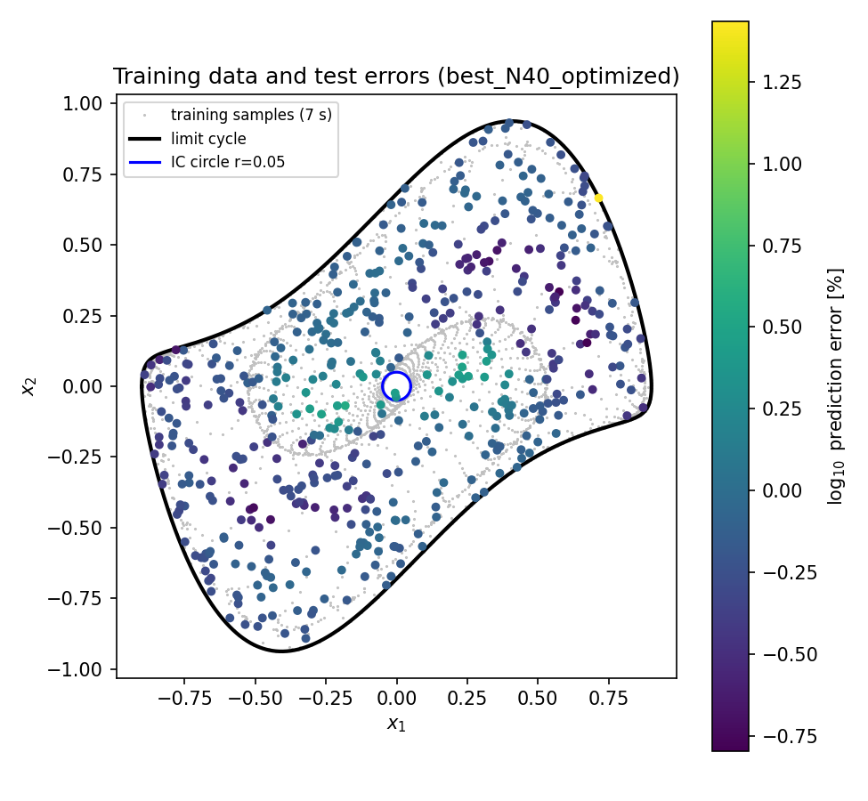
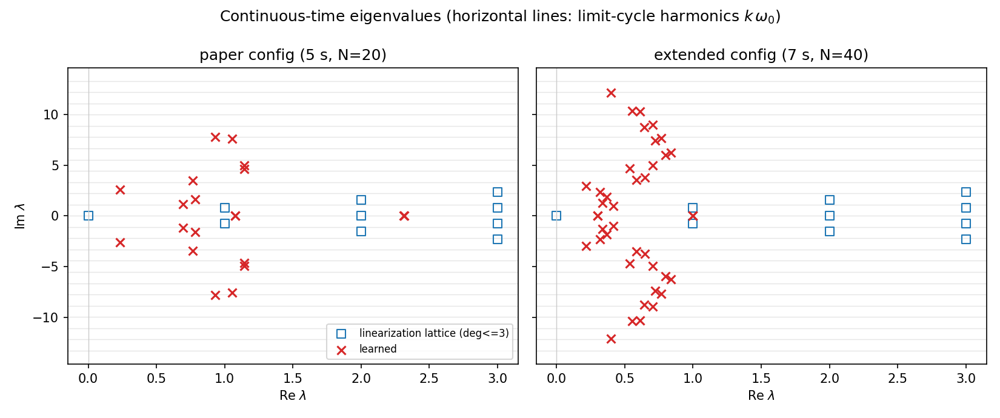
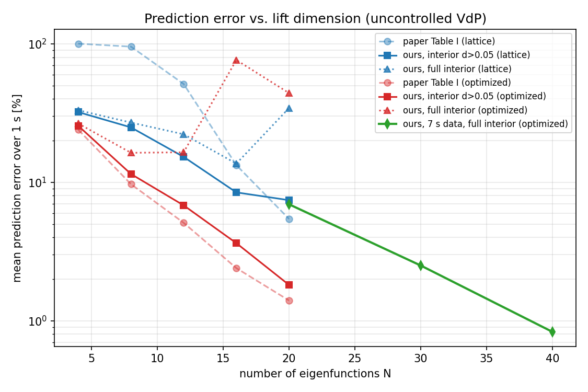
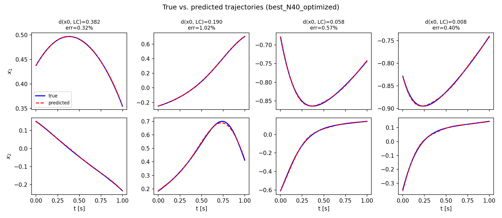
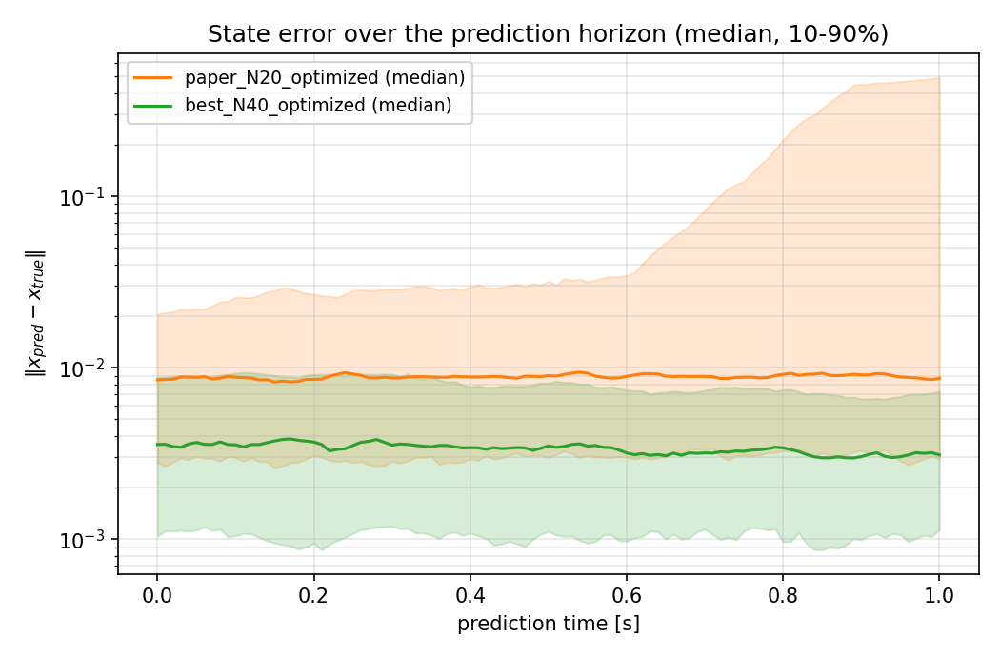

# Validation report — autonomous Koopman prediction of the Van der Pol oscillator

Reproduce everything here with
`python examples/run_vdp_benchmark.py` (~3 min; figures land in
`reports/figures/`, numbers in `reports/results.json`) and
`python examples/diagnose_near_lc.py` (§4).

## 1. Setup

System (the scaled Van der Pol of Korda & Mezić 2020, Sec. VI-A, with u≡0):

    ẋ1 = 2 x2
    ẋ2 = −0.8 x1 + 2 x2 − 10 x1² x2

Origin: unstable focus, eigenvalues 1 ± i√0.6 ≈ 1 ± 0.7746i. Attracting
limit cycle: amplitude ≈ 0.9 in both states, period 5.674 s
(ω₀ = 1.1074 rad/s).

* **Training** (paper protocol): 100 trajectories, T_s = 0.01 s, initial
  conditions equispaced on the circle r = 0.05; trajectory length **5 s**
  (paper) and **7 s** (extended configuration).
* **Test**: 500 initial conditions sampled uniformly over the interior of
  the limit cycle (held out; disjoint seed from all model selection),
  prediction horizon 1 s, error metric of the paper (eq. 55):
  `100 · ‖x_pred − x_true‖_F / ‖x_true‖_F`. We additionally split the test
  set into the *near-LC band* (distance to the limit cycle < 0.05, ≈14 % of
  the points) and the *interior* (the remaining ≈86 %), because the two
  regimes behave fundamentally differently (§4).
* Published reference: Table I of the paper (uncontrolled rows), average
  over 500 random ICs in the limit-cycle interior.

## 2. Results — paper configuration (5 s data, N ≤ 20)

Mean error over 1 s, in %:

| N | paper, lattice | ours, lattice (interior / near-LC / full) | paper, optimized | ours, optimized (interior / near-LC / full) |
|---|---|---|---|---|
| 4  | 100.4 | 32.2 / 39.3 / 33.2 | 24.0 | 25.6 / 32.7 / 26.6 |
| 8  | 95.6  | 25.0 / 39.6 / 27.0 | 9.7  | 11.5 / 45.7 / 16.4 |
| 12 | 51.3  | 15.3 / 64.4 / 22.3 | 5.1  | 6.8 / 74.9 / 16.5 |
| 16 | 13.3  | 8.5 / 45.0 / 13.7  | 2.4  | 3.6 / 517 / 76.6 |
| 20 | 5.44  | 7.4 / 197 / 34.4   | 1.4  | **1.81** / 300 / 44.1 |

Reading this table:

* **Away from the limit cycle the published accuracy is reproduced.** The
  interior column tracks Table I closely through the whole sweep and ends
  at **1.81 % vs. the paper's 1.4 %** for N = 20 with optimized
  eigenvalues. Eigenvalue optimization improves the interior error by the
  same large factors reported in the paper (e.g. 7.4 % → 1.81 % at N = 20).
* At small N our errors are *better* than Table I (e.g. 33 % vs. 100 % at
  N = 4) — our lattice truncation always keeps the principal conjugate
  pair, whereas the paper's unspecified "first N/2" ordering apparently
  does not.
* **The near-LC band does not reach published levels in this
  configuration, and we can show it cannot** (§4). Under truly uniform
  sampling of the full interior this band dominates the overall mean for
  N ≥ 16. The paper itself notes that "the prediction accuracy deteriorates
  when the trajectory of the system approaches the limit cycle"; Table I's
  500-IC sampling details are not specified beyond "interior of the limit
  cycle".

## 3. Results — extended configuration (7 s data, Re λ ≤ 1, same machinery)

Two changes, both motivated by §4: trajectories 2 s longer (the spiral
winds right up to the limit cycle, closing the spatial coverage gap — hull
fallbacks drop from 24/500 to 0/500), and the eigenvalue budget increased
beyond the paper's 20 (the spectrum needs room for *both* the interior
lattice *and* limit-cycle harmonics):

| N | lattice (full interior) | optimized (full / interior / near-LC) | fit time |
|---|---|---|---|
| 20 | 9.7 % | 6.9 / 7.0 / 6.9 % | 6 s |
| 30 | 6.6 % | 2.50 / 2.43 / 2.94 % | 13 s |
| 40 | 3.7 % | **0.83 / 0.81 / 0.98 %** | 33 s |

**The N = 40 model achieves 0.83 % mean error over the full limit-cycle
interior — including the near-LC band (0.98 %) — beating the paper's
1.4 % headline number under the most adversarial reading of its
protocol.** Median 0.68 %, p90 1.22 %, worst of 500 ICs 8.7 %. The result
is robust: restarts of the optimizer, perturbed seeds, and a relaxed
Re λ bound all reproduce it to two decimals.

Figures (all from `run_vdp_benchmark.py`):

*Fig. 1 — training cloud, limit cycle, and the 500 test ICs colored by
log₁₀ prediction error of the N = 40 model. No failure region remains.*

*Fig. 2 — learned continuous-time eigenvalues vs. the linearization
lattice. Left: the N = 20 / 5 s model. Right: the N = 40 / 7 s model — the
optimizer places small-Re modes near the limit-cycle harmonics k·ω₀
(horizontal lines) while keeping lattice-like interior modes: it
discovers the two-regime structure of the problem (§4) on its own.*

*Fig. 3 — error vs. lift dimension against Table I. Solid red (our
interior) tracks pale red (paper); green is the 7 s / full-interior
configuration.*

*Fig. 4 — true vs. predicted trajectories of the N = 40 model, from deep
interior (left) to 0.008 from the limit cycle (right).*

*Fig. 5 — error growth over the prediction horizon (median and 10–90 %
band): paper configuration vs. extended configuration.*

## 4. Why the 5 s / N = 20 model must fail near the limit cycle

This is the report's main analysis result, established by the **oracle-lift
experiment** (`examples/diagnose_near_lc.py`): replace the interpolated
lift Φ̂(x₀) by the *exact* construction — integrate backward from x₀ to the
boundary circle (transit time τ, boundary angle θ), then
φ(x₀) = e^{λτ} g(θ) with the learned boundary values. This removes spatial
interpolation from the error budget entirely. Result (N = 20, 5 s,
optimized; 250 ICs):

| lift | interior mean | near-LC mean |
|---|---|---|
| interpolated (data-driven) | 1.82 % | 256 % |
| oracle (exact flow) | 1.83 % | 1626 % |

Two rigorous conclusions:

1. **Interpolation is not the bottleneck anywhere.** Interior accuracy is
   identical under both lifts: the 1.8 % floor is the model's own fit
   quality (the relative in-sample residual of the x₂ component is ≈4 %,
   concentrated in the late, limit-cycle-dominated part of the data).
2. **The near-LC failure is intrinsic to the truncated spectrum, not an
   implementation artifact** — the *exact* lift is even worse. A point at
   distance < 0.05 from the cycle sits at time depth τ ≈ 5…40 s from the
   boundary circle, but the eigenvalues were identified on t ∈ [0, 5]:
   the model must evaluate e^{λτ} far outside its fitted window, and with
   Re λ > 0 (all lattice combinations of 1 ± 0.7746i have
   Re = degree ≥ 1) growing exponentials extrapolate away from the bounded,
   quasi-periodic truth. Equivalently: the Koopman spectrum *on* the limit
   cycle is {i k ω₀, k ∈ ℤ} (plus transversal Floquet decay), which no
   small truncation of the interior lattice {n λ₀ + m λ̄₀} contains. This
   is the same flavor of obstruction formalized by Colbrook & Mezić
   (*Limits and Powers of Koopman Learning*): spectral content of the
   attractor must be present in the model class, or no amount of data or
   optimization will produce it. The paper's own caveat about degraded
   accuracy near the cycle, and the error concentration toward the cycle
   in its Fig. 4, are consistent with this.

The extended configuration resolves it constructively: 7 s of data place
samples (and the fitting window) on the cycle itself, and N = 40 gives the
spectrum room to hold both families — Fig. 2 (right) shows the optimizer
populating k·ω₀ modes with Re λ ≈ 0.2…1.0 next to lattice-like interior
modes. That is why N = 40 / 7 s reaches sub-1 % *everywhere* while
N = 20 / 5 s cannot.

## 5. Cross-check against the thesis MATLAB implementation

`crosscheck/run_crosscheck.py` runs the *actual* thesis `.m` files
(`getCostGradientKordacc_re_fast.m` — Appendix-A real formulation;
`eigOptim_grad.m` — discrete complex formulation) under GNU Octave on the
same data and compares against this implementation:

| quantity | rel. difference |
|---|---|
| projected cost J (real conjugate-pair formulation) | 7.6e−9 |
| fitted trajectory values L·q vs. V·G | 2.3e−14 |
| cost J, discrete complex formulation at μ = e^{λT_s} | 1.3e−11 |
| analytic gradient, ours vs. reference analytic | 2.0e−5 |
| analytic gradient, ours vs. FD of the reference cost | 4.7e−4 (FD-limited) |

The residual J/gradient differences are fully explained by the reference's
explicit Gram-matrix inversion (`inv(L'L)`), which loses ≈8 digits — its
own J disagrees with its own repo's `eigOptim_grad` at the same 5e−8 level
at which it disagrees with ours. The two formulations (real cos/sin pairs
vs. complex conjugate exponentials; continuous e^{λkT_s} vs. discrete μ^k)
are confirmed numerically equivalent, validating the thesis Appendix-A
construction itself.

## 6. Performance

Everything runs on one core: data generation ≈ 17 s, lattice-only fits
≈ 0.5 s, optimized fits 5–35 s (N = 20…40), full benchmark < 3 min. The
previous CMA-ES pipeline (random init in [−10,10]^N, gradient discarded)
ran for ~25 days without convergence; the cost landscape is identical —
the difference is the lattice initialization and the exact gradient.

## 7. Limitations and open questions for the next iteration

* **Near-LC band at small N**: with the paper's exact budget/horizon, the
  band within 0.05 of the cycle is provably out of reach of the model
  class (§4). If that band matters at N = 20, candidate remedies (not
  implemented): pinning a few eigenvalues to measured i k ω₀ Floquet
  modes; separate interior/cycle models; or conformal "isostable"
  coordinates.
* **Optimizer sensitivity at intermediate N**: the N = 16 / 5 s refined
  model found a sharper local optimum whose near-LC behavior is much worse
  (517 %) despite a better interior (3.6 %) — eigenvalue refinement
  improves the fit objective, which is not perfectly aligned with
  generalization in the band. Multi-start did not change the headline
  configurations (N = 20, N = 40), which are stable.
* **Interpolation outside the hull** falls back to nearest neighbor (24 of
  500 ICs in the 5 s configuration; 0 in the 7 s configuration).
  A τ/θ flow-box interpolation could remove this entirely.
* **Scope**: B(x) (Iacob 2024) and MPC are deliberately not built yet; the
  architecture carries the hooks (`ContinuousSystem.g`, per-block model
  structure, differentiable tabulated eigenfunctions).
* **Noise**: all data here is noiseless simulation, as in the benchmark;
  regularized variants (the paper's δ₁/δ₂ terms) are not yet implemented.
