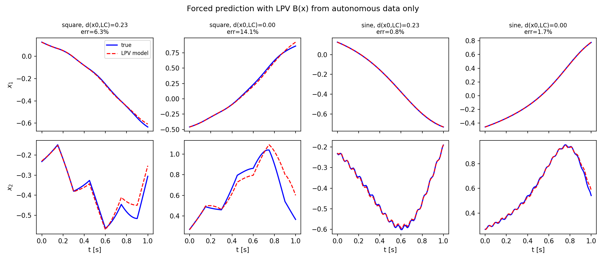
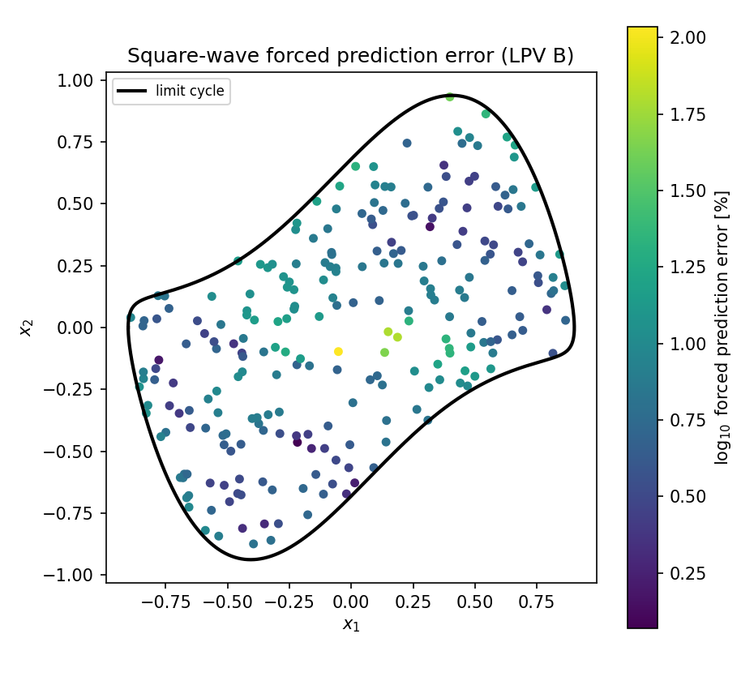
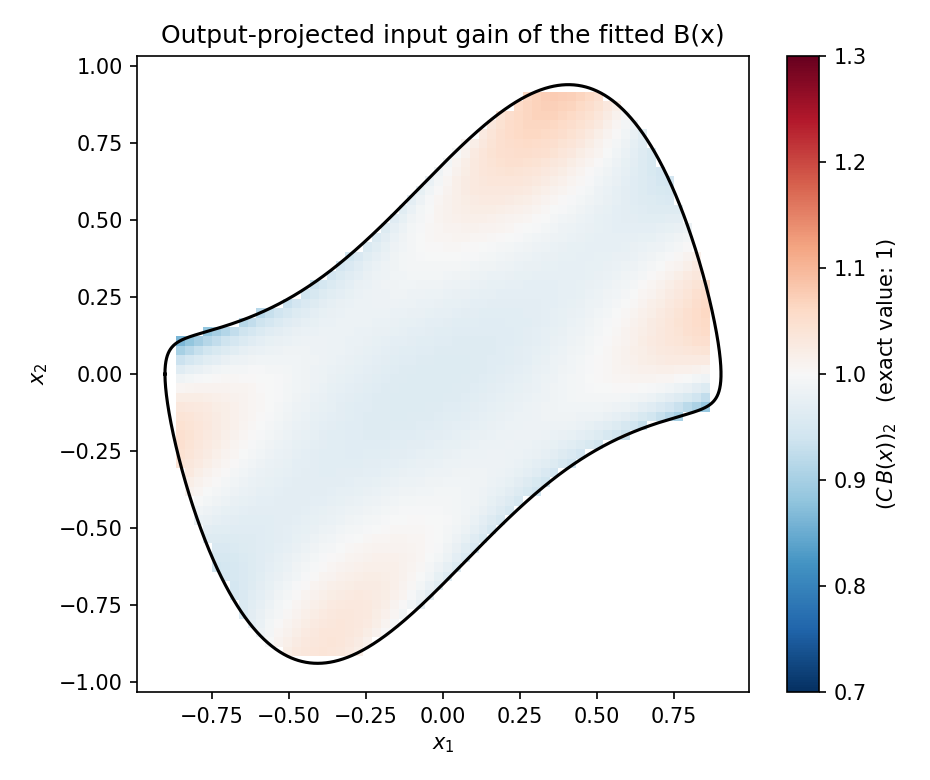
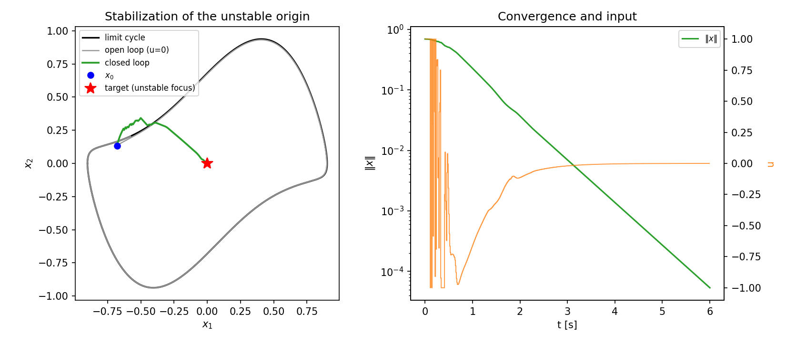
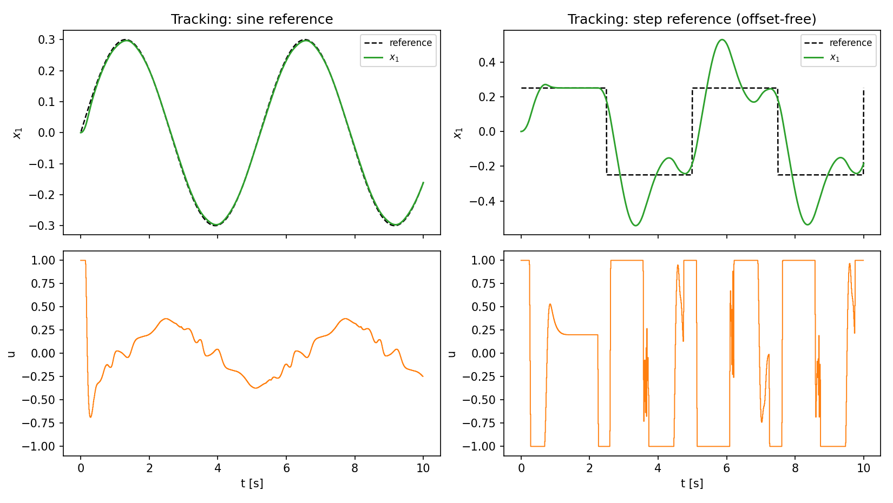

# Validation report — LPV input matrix B(x) and Koopman-LPV MPC (Van der Pol)

Phase-2 results, building on the autonomous model of
[`validation_vdp.md`](validation_vdp.md) (N = 40, 7 s data, 0.83 %
autonomous prediction error). Reproduce with
`python examples/run_vdp_control_benchmark.py` (~3 min) and
`python examples/run_vdp_mpc.py` (~4 min); numbers land in
`reports/results_control.json` / `results_mpc.json`.

**Headline: the thesis's central claim is validated end-to-end.** The
state-dependent input matrix B(x) = ∂Φ/∂x·g_c(x) built **exclusively from
autonomous trajectory data** (no forced experiments anywhere) delivers
forced-prediction accuracy competitive with — and on one of two benchmark
signals better than — Korda & Mezić's constant B that was *fitted to
forced data*, and it supports a real-time MPC that stabilizes the unstable
origin and tracks moving references on the true nonlinear plant.

## 1. Eigenfunction gradients (the make-or-break ingredient)

B(x) needs ∂Φ/∂x; Φ is known as tabulated values on the trajectory cloud.
Quality is measured by the eigenfunction-PDE residual
‖(∂Φ/∂x)f − AΦ‖/‖AΦ‖, which is exactly zero along trajectories for the
ideal construction (200 interior test points):

| gradient estimator | median residual | p90 |
|---|---|---|
| **moving least squares (k=40, quadratic)** | **0.026** | 2.4 |
| central FD on interpolant, h=1e-3, order 4 | 0.093 | 2.8 |
| central FD, h=0.01, order 4 | 0.051 | 3.0 |
| central FD, **h=0.1, order 2 (the thesis/MATLAB default)** | **0.62** | 43 |

Two findings: (i) MLS is the best estimator and is used throughout;
(ii) the reference implementation's `build_B_numgrad` default step
h = 0.1 destroys the gradients (62 % median error) — eigenfunction
features near the origin are smaller than the stencil. This is another
structural defect of the original pipeline, now quantified.

## 2. Raw pointwise B(x) is exact-in-principle but unusable — and the fix

Raw MLS gradients give ‖B(x)‖ with median ≈ 1.5e4 in the interior,
≈ 4e5 within 0.05 of the limit cycle, max ≈ 2e7: the individual
eigenfunction surfaces are steep (their reconstruction relies on
cancellation), so pointwise B estimates are huge and noisy. Rolling the
lifted model forward with them injects O(‖B_err‖) into expanding modes
every step — forced predictions **explode** (median error 21,556 % on the
square wave).

The fix, still autonomous-data-only (`fit_b_field`): fit one global
low-order polynomial per lifted row of B(x) over the operating region,
weighting samples by PDE-residual quality. This denoises and bounds the
field while preserving its state dependence; its output projection
C·B(x) lands within ~10 % of the exact value [0, 1] everywhere
(fig8_B_gain_map.png). Degree 0 of the same fit provides the constant-B
(LTI) baseline.

## 3. Forced prediction vs. the published controlled benchmark

Paper protocol (Sec. VI-A controlled): unit-amplitude square wave
(300 ms period) and sine (60 ms period), 1 s horizon, eq. (55) error;
250 ICs uniform over the limit-cycle interior. Reference: Table I,
N = 20 optimized, with **constant B identified from a dedicated forced
dataset**: square 6.0 %, sine 2.9 %.

| input model (ours: autonomous data only) | square: mean / median | sine: mean / median |
|---|---|---|
| **LPV B(x), polynomial deg 4** | **8.4 % / 6.5 %** | **1.30 % / 1.03 %** |
| constant B (deg-0 reduction) | 12.6 % / 8.4 % | 1.61 % / 1.17 % |
| raw pointwise MLS B(x) | 2.9e7 % / 21,556 % | 1.9e7 % / 1.15 % |
| paper (constant B from forced data) | 6.0 % | 2.9 % |

* **Sine: 1.30 % vs. the paper's 2.9 %** — better, with zero forced data.
* Square: 8.4 % vs. 6.0 % — same ballpark; the square wave's ±1 plateaus
  push trajectories across (and partly beyond) the trained region, where
  the near-LC error band of the autonomous model (see Phase-1 report §4)
  is re-excited at every switch. Error is concentrated near the limit
  cycle (fig7_forced_error_map.png), exactly as in the paper's own Fig. 4.
* **The LPV field beats its own constant reduction by ~1.5× on the square
  wave** — direct evidence of the value of state dependence, isolated
  from every other pipeline ingredient (same model, same fit, same data).

## 4. Koopman-LPV MPC on the true plant

Controller: lift measured state, freeze B(x_k) over the horizon
(exact ZOH discretization, closed-form blockwise Γ = A⁻¹(e^{ATs}−I)),
solve the condensed tracking problem as a box-constrained least-squares
(`scipy.optimize.lsq_linear` — no extra QP dependency), apply u₀,
repeat at 100 Hz. Solve time ≈ 11 ms/step (horizon 80, N = 40, pure
Python) — real-time-rate feasible.

| task | result |
|---|---|
| **Stabilize the unstable origin** from 92 % of the limit-cycle radius, \|u\| ≤ 1 | ‖x‖: 0.69 → 3.7e-2 (2 s) → 1.4e-3 (4 s) → **5.4e-5 (6 s)**; open loop diverges to the cycle |
| **Track x₁ = 0.3 sin(1.2t)** | **RMS error 0.0041 (1.4 % of amplitude)**, max error 0.0069 |
| Piecewise-constant setpoints x₁ = ±0.25 (offset-free variant) | settled RMS 0.066; first setpoint settles cleanly (u → 0.20, the exact equilibrium input), later segments ring after reference jumps — see §5 |

## 5. Documented limitation: stationarity bias at off-origin setpoints

Constant-setpoint regulation exposes a structural weakness, with a clean
diagnosis:

* Open-loop, from the true equilibrium (0.25, 0) under the true
  equilibrium input u* = 0.2, the lifted model holds position for
  ≈ 0.5 s and then drifts (to (0.19, −0.18) by 1 s).
* Inverting the model for the stationary input at (±0.25, 0) gives
  u_ff ≈ ±0.78 versus the true ±0.2 — a ~4× bias.

Root cause: the model is trained (and excellent) at predicting **along
flows**; pointwise stationarity C(Az + B(x)u) = 0 requires exact
cancellation between large lifted terms, which magnifies small fitting
errors. Feedback hides most of this (the loop holds the setpoint to
within 0.03–0.06), an output-disturbance estimator (`offset_free=True`)
removes part of the rest, but ~0.05 of bias/ringing survives reference
jumps. Integral action with naive anti-windup made it worse (tested).
Remedies for the next iteration: equilibrium-anchored local correction of
(A, B) around target setpoints, or a disturbance model in the lifted
state rather than the output.

## 6. What carries over from the references — and what was changed

* Iacob et al. (2024): B(x) = ∂Φ/∂x·g_c(x) — implemented as stated; the
  *practical* contribution here is the residual-weighted smooth field fit
  (§2), without which the exact formula is numerically unusable on a
  system with expanding modes.
* Thesis: gradient-based B from autonomous data — vindicated; its
  finite-difference defaults (h = 0.1) and the absence of field smoothing
  explain why this step underperformed in the original pipeline. The
  thesis's stable-equilibrium case studies (Duffing, pendulum) were also
  far more forgiving: contracting A absorbs B-noise injections, VdP's
  expanding A amplifies them.
* MPC: standard qLPV-Koopman scheme (freeze B at the measured state per
  step). Box-constrained-input QP solved exactly via bounded least
  squares; state constraints and a proper QP solver (e.g. OSQP) are the
  natural extension when needed.

## 7. Open items for the next iteration

* Stationarity-bias correction at setpoints (§5) — the one blocker for
  precision regulation away from the origin.
* Square-wave-class inputs that drive the state outside the trained
  region: extend training coverage outward (the bidirectional sampler in
  `systems.generate_data` is ready for this) or add input-aware data.
* State/output constraints in the MPC (switch to a general QP solver).
* Multi-input systems and the vehicle models from the thesis: the entire
  B(x)/MPC path is written for m ≥ 1, only the 2-D MLS gradient kernel
  assumes n = 2 and needs the trivial generalization.
* Iacob et al.'s LTI-vs-LPV error bounds: quantify them on this example
  and compare with the measured 1.5× square-wave gap.
